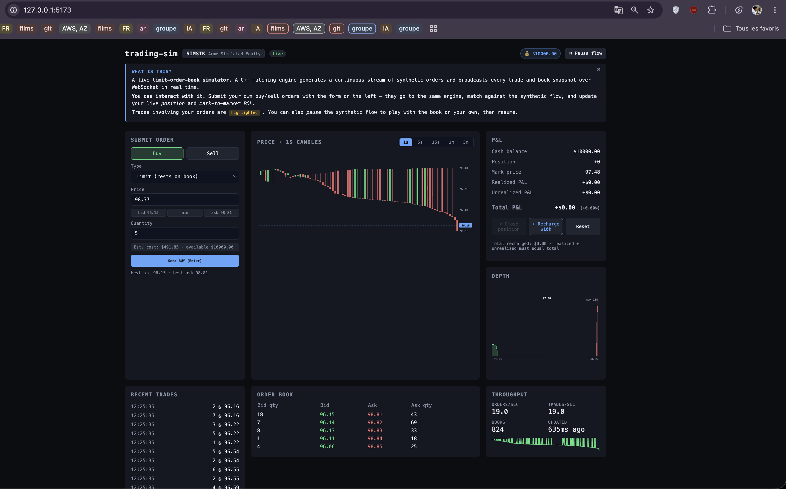
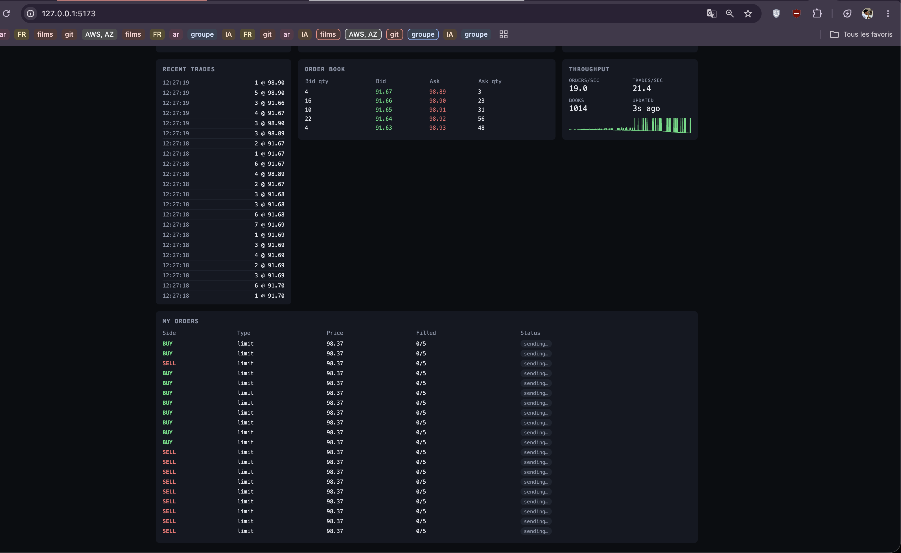

# trading-sim

A real-time limit-order-book simulator. End-to-end demonstration of modern C++,
TypeScript/Node.js, React, Qt 6 and CI/CD — built as a single coherent system.

## Screenshots & demo

The web dashboard, top of the screen — submit panel, candlestick chart with
the interval picker (1s / 5s / 15s / 1m / 5m), live P&L with cash balance,
position, avg cost, realized vs unrealized:



Below the fold — recent trades tape, order book table, throughput stats, and
the user's own orders with their live status:



### Live demo

Short screen recording of the dashboard in action — submitting orders, watching
fills, P&L updating, candles bucketing in real time.

<video src="https://github.com/Moutacdie2000/trading-sim/raw/main/docs/media/dashboard-demo.mov" controls width="800"></video>

> If your browser doesn't render the inline player, download the demo
> directly: [`docs/media/dashboard-demo.mov`](docs/media/dashboard-demo.mov).

## Architecture

```
 ┌─────────────────────────────────────────────────────┐
 │  engine/  (C++17)                                   │
 │  ├─ OrderBook (thread-safe, price-time priority)    │
 │  ├─ OrderType { Limit, Market, IOC, FOK }           │
 │  ├─ FlowGenerator (Poisson arrivals, seeded RNG)    │
 │  ├─ sim_runner CLI — NDJSON to stdout               │
 │  ├─ GoogleTest suite (matching + flow)              │
 │  └─ benchmarks/ (5.7M orders/sec, p99 0.42 µs)      │
 └────────────────────────┬────────────────────────────┘
                          │ child-process stdout (NDJSON)
                          ▼
 ┌─────────────────────────────────────────────────────┐
 │  gateway/  (Node.js 20 + TypeScript)                │
 │  ├─ Fastify + ws — fans out over /feed              │
 │  ├─ Hub<S> (framework-agnostic, generic)            │
 │  ├─ Engine restart loop (exp. backoff, bailout)     │
 │  ├─ /healthz · /metrics (Prometheus text)           │
 │  └─ Vitest — 16 tests, injectable timers/clock      │
 └──────┬─────────────────────────────────────────┬────┘
        │ WebSocket /feed                         │ WebSocket /feed
        ▼                                         ▼
 ┌────────────────────────────┐    ┌─────────────────────────────┐
 │  web/  (React 18 + Vite)   │    │  desktop/  (Qt 6 / QML)     │
 │  ├─ Depth chart (SVG)      │    │  ├─ DepthView (Canvas)      │
 │  ├─ Order book table       │    │  ├─ TradesRibbon (ListView) │
 │  ├─ Trades tape            │    │  ├─ FeedClient (QObject)    │
 │  ├─ Stats + sparkline      │    │  └─ Backoff reconnect       │
 │  ├─ Reconnect w/ countdown │    │                             │
 │  └─ Vitest — 11 tests      │    │                             │
 └────────────────────────────┘    └─────────────────────────────┘
```

## Wire protocol

The engine emits **NDJSON, one event per line**, on stdout. The gateway parses
each line and rebroadcasts it verbatim over WebSocket.

```jsonc
{"type":"trade","ts":1715600000123,"price":100.50,"qty":4,"buy":1,"sell":2}
{"type":"book","ts":1715600000124,"bids":[[100.0,10]],"asks":[[101.0,5]]}
{"type":"stats","ts":1715600000125,"orders":520,"trades":134,"books":52}
```

Unknown event types are ignored defensively at every consumer.

## Layout

| Folder        | Stack                              | What it does                                          |
|---------------|------------------------------------|-------------------------------------------------------|
| `engine/`     | C++17, CMake, GoogleTest           | Matching engine, flow generator, sim runner, benches  |
| `gateway/`    | Node.js 20, TypeScript, Fastify, ws | Spawns engine, fans out events, exposes /metrics      |
| `web/`        | React 18, Vite, TypeScript         | Live dashboard (depth, book, tape, stats)             |
| `desktop/`    | Qt 6, QML, C++17                   | Desktop client (depth view, trades ribbon, reconnect) |
| `benchmarks/` | C++17, `<chrono>`                  | Hot-path microbenchmarks for the order book           |
| `.github/`    | GitHub Actions                     | Engine build/test on Linux, gateway+web lint/test     |

## Quick start

```bash
# 1. Engine — build + run unit tests
cd engine
cmake -S . -B build -DCMAKE_BUILD_TYPE=Release
cmake --build build -j
ctest --test-dir build --output-on-failure

# 2. Gateway — spawns the engine binary as a child process
cd ../gateway
npm install
ENGINE_BIN=../engine/build/apps/sim_runner npm run dev

# 3. Web dashboard
cd ../web
npm install
npm run dev    # → http://localhost:5173

# 4. (Optional) Qt 6 desktop client
cd ../desktop
cmake -S . -B build
cmake --build build -j
./build/trading_desktop
```

## sim_runner CLI

```
sim_runner [--rate=<orders/sec>] [--mid=<price>] [--seed=<int>]
           [--duration=<sec>]    [--book-depth=<int>]
```

Defaults: `--rate=20 --mid=100 --seed=<epoch> --duration=0 --book-depth=5`.
A duration of `0` runs until SIGINT.

## Build options

| CMake option            | Default | Effect                                            |
|-------------------------|---------|---------------------------------------------------|
| `ENGINE_BUILD_TESTS`    | ON      | Build `engine_tests` (GoogleTest, fetched)        |
| `ENGINE_BUILD_APPS`     | ON      | Build the `sim_runner` CLI                        |
| `ENGINE_BUILD_BENCHES`  | OFF     | Build `bench_order_book` (stdlib-only)            |
| `ENGINE_USE_ASAN`       | OFF     | `-fsanitize=address,undefined` on engine & tests  |

## Gateway endpoints

| Path        | Method | Description                                                                |
|-------------|--------|----------------------------------------------------------------------------|
| `/feed`     | WS     | Live NDJSON stream from the engine                                         |
| `/healthz`  | GET    | 200 iff engine is alive AND an event was received within the last 10 s     |
| `/metrics`  | GET    | Prometheus text format: clients, events_total{type}, engine_restarts_total |

## Tests

```bash
# Engine
ctest --test-dir engine/build --output-on-failure
# 14 GoogleTest cases: matching, Market/IOC/FOK, snapshot, flow generator

# Gateway
cd gateway && npm test
# 16 Vitest cases: hub, metrics, types, engine_process (with mocked spawn + timers)

# Web
cd web && npm test
# 11 Vitest cases: DepthChart pure render, StatsPanel rate calc, useEngineFeed reconnect
```

## Benchmarks (engine, release, M2)

| Pre-populated levels | Orders/sec | p50 add\_order | p99 add\_order |
|---------------------:|-----------:|---------------:|---------------:|
|                  100 |       ~5 M |        0.08 µs |        0.42 µs |
|               10 000 |       ~5 M |        0.08 µs |        0.42 µs |

Run yourself with `cmake -DENGINE_BUILD_BENCHES=ON ...` then `./build/benchmarks/bench_order_book`.

## A note on representation

Prices are stored as `double` for simplicity. Real-world matching engines use
fixed-point ticks (`std::int64_t`) to avoid the well-known FP equality pitfalls.
A switch is mechanical (replace `Price = double` with a `Tick` type and provide
a converter) and intentionally left as an exercise — the architecture is
agnostic to the numeric representation.

## Roadmap

- [x] **Phase 0** — Scaffold (everything compiles, tests pass, CI green)
- [x] **Phase 1** — Realistic order flow (Poisson arrivals, configurable spread, Market/IOC/FOK)
- [ ] **Phase 2** — Persistence (SQLite-backed trade tape, replay from a recorded run)
- [ ] **Phase 3** — Tick-based fixed-point prices; more Qt screens (book heatmap, P&L)
- [ ] **Phase 4** — Distributed engine (multi-instrument, sharded by symbol)
- [ ] **Phase 5** — Latency stress harness (1M orders/sec target, perf regression CI)

## License

MIT — see [LICENSE](LICENSE).
